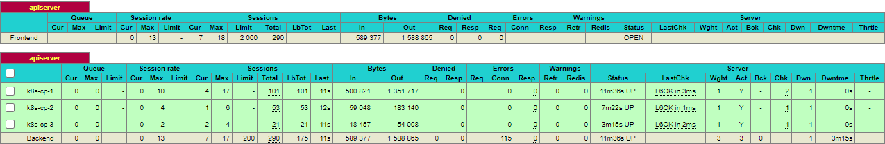

# Kubernetes on Windows + VirtualBox with Vagrant and Ansible

An example setup of HA Kubernetes cluster with WSL2 + Vagrant + Ansible on your home PC.

## Prerequisities

- 8 core CPU (for 3 control plane, 2 data plane nodes and 1 load balancer)
- 25GB RAM (for 3 control plane, 2 data plane nodes and 1 load balancer)
- [Install VirtualBox for Windows](https://www.virtualbox.org/wiki/Downloads)
- [Install WSL and Ubuntu 20.04](https://docs.microsoft.com/en-us/windows/wsl/install-win10#manual-installation-steps)
  - [Install Vagrant](https://www.vagrantup.com/docs/other/wsl)
  - [Install Ansible](https://docs.ansible.com/ansible/latest/installation_guide/intro_installation.html#installing-ansible-on-ubuntu)
  - [Install `kubectl`](https://kubernetes.io/docs/tasks/tools/install-kubectl-linux/#install-using-native-package-management)

## Create Kubernetes cluster

- Open WSL shell and configure Vagrant for WSL

  ```sh
  source .wsl-env
  ```

- Provision VMs

  ```sh
  vagrant up
  ```

- Navigate to HAProxy stats at http://192.168.50.5:8404/stats

  You should see `apiserver` backends turning green in load balancer as the cluster is being provisioned.

  

- Copy `kubeconfig` to host machine

  ```sh
  vagrant ssh k8s-cp-1 -c 'mkdir -p /vagrant/.kube && cp .kube/config /vagrant/.kube/config'
  ```

  ⚠️ `/vagrant/.kube/config` will contain credentials for `kubernetes-admin`.

- Check out Kubernetes nodes and pods

  ```sh
  export KUBECONFIG=.kube/config
  kubectl get nodes
  kubectl get pods -A
  ```
